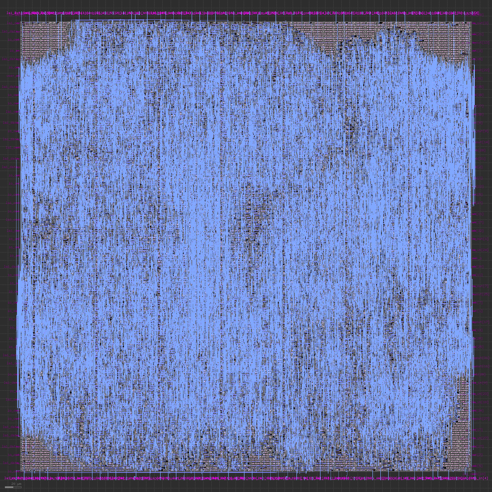

# The Ibnalhaytham CPU
Please note that this is not the tapeout repository, to see the tapeout files visit https://github.com/sfmth/wrapped_ibnalhaytham
### Naming criteria:
This project was named after the great Arabic scientist Ibn al-haytham to honor his contributions to science, his most important work is the Kitab al-Manazir (Book of Optics). In the 11Th century he managed to pioneer significant contributions in the field of optics and has been referred to as "the father of modern optics". 

<p align="center" float="center">
  
   
</p>

Numerous scientists from the Golden age of Islam usually don't get the respect they deserve, I used this opportunity to remind the scientific community of the contributions of these scientists. They were an early pioneer in the scientific method five centuries before Renaissance scientists, they employed experiments and innovation in their research long before anyone else did.

To name a few:
- Persian mathematician al-Khwarizmi, who is regarded as "the father of algebra".
- Persian physician, philosopher and alchemist Abu Bakr al-Razi, who has been described as the father of pediatrics, and a pioneer of obstetrics and ophthalmology. Notably, he became the first human physician to recognize the reaction of the eye's pupil to light.
- Persian physician and philosopher Ibn Sina (Avicenna), the father of early modern medicine, his book The Canon of Medicine, became a standard medical text at many medieval universities and remained in use as late as 1650.
- Arab physician and surgeon al-Zahrawi, is considered to be the greatest surgeon of the Middle Ages, he has been referred to as the "father of modern surgery".

## Introduction
This project is consisted of a memory controller and a processor; The processor is a RISC-V based pipelined processor with 16 registers. The memory controller simulates an instruction memory and has 10 32bit words as the data memory, the contents of which are outputted to io_out periodically. The simulated instruction memory is in fact an interface between the caravel management core and the processor, it can stall the processor until the next instruction arrives from the management core. The source code is clean and commented, you should be able to easily understand what's going on.

<p align="center" float="center">
  
</p>

## Processor
<p align="center" float="center">
  
</p>
The processor module is a 32bit 5 stage pipelined RISC-V based processor with 16 registers, it does not support full RV32I but only a subset of its instructions are supported:

```
lw, addi, slti, ori, andi, sw, add, sub, slt, or, and, beq, jal
```
The microarchitecture is based on the one introduced in the following book, if you want to understand this project better it is recommended to take a look at this book.
> Digital Design and Computer Architecture, RISC-V Edition by David Harris and Sarah L. Harris

The processor module adds support for a stall signal that can stall instruction fetch until the next instruction is ready. Here is a schematic of the fetch stage with support for handling hazards associated with the new stall signal:
<p align="center" float="center">
  
</p>

## Memory Controller
<p align="center" float="center">
  
</p>
This module takes care of memory requests made by the processor, it has a small data memory which consists of 8 normal words and 2 words with custom addresses 'd96 and 'd100. The data memory always gets outputted into io_out, a counter counts the address and outputs both the address and it's data to io_out. 

The memory controller module also interfaces with the second bank of the logic analyzer available in caravel wrapper. When io_in[1:0] equals 'd3 the memory controller uses la1 as the instruction memory and caravel CPU is going to handle the requests made by memory controller. When io_in[1:0] isn't 'd3 then memory controller connects the data memory to la1 and we would be able to read the data memory by providing an address from caravel CPU.

## Test it yourself
You should be able to run the simulation by running the following command:

```
make delete; make test_fin; make gtkwave
```

What it does is that it uses test/test_wrapped_ibnalhaytham.py as a cocotb test module alongside verilog and then opens gtkwave to view the resulting signals.
By assigning True the variable SINGLE in the makefile you can test out individual modules by changing the NAM variable to name of the desired module. You can also use make_show_synth_png to view the synthesized model by yosys.

You can also simulate this project inside caravel, the test files are provided in the tapeout repository: https://github.com/sfmth/wrapped_ibnalhaytham

## Final GDS
<p align="center" float="center">
  
</p>

## TODO
- use smaller memory and register addresses
- test the memory controller for openram

