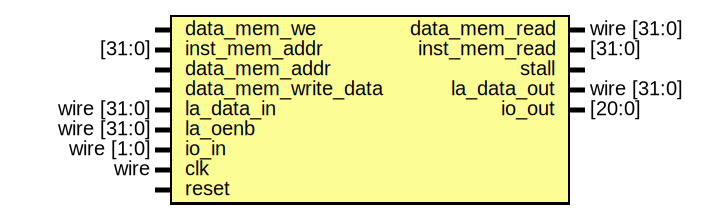

# Entity: memory_controler

- **File**: memory_controler.v
## Diagram

## Ports

| Port name           | Direction | Type        | Description |
| ------------------- | --------- | ----------- | ----------- |
| data_mem_read       | output    | wire [31:0] |             |
| inst_mem_read       | output    | [31:0]      |             |
| data_mem_we         | input     |             |             |
| inst_mem_addr       | input     | [31:0]      |             |
| data_mem_addr       | input     |             |             |
| data_mem_write_data | input     |             |             |
| stall               | output    |             |             |
| la_data_in          | input     | wire [31:0] |             |
| la_data_out         | output    | wire [31:0] |             |
| la_oenb             | input     | wire [31:0] |             |
| io_in               | input     | wire [1:0]  |             |
| io_out              | output    | [20:0]      |             |
| clk                 | input     | wire        |             |
| reset               | input     |             |             |
## Signals

| Name                  | Type       | Description |
| --------------------- | ---------- | ----------- |
| data_mem_array        | reg [31:0] |             |
| la_data_out_inst_addr | reg [31:0] |             |
| cnt                   | reg [5:0]  |             |
| inst_mem_addr_1       | reg [31:0] |             |
| la_oenb_1             | reg [31:0] |             |
## Processes
- unnamed: ( @(negedge clk) )
  - **Type:** always
- unnamed: ( @(posedge clk) )
  - **Type:** always
- unnamed: ( @(posedge clk) )
  - **Type:** always
- unnamed: ( @(posedge clk) )
  - **Type:** always
